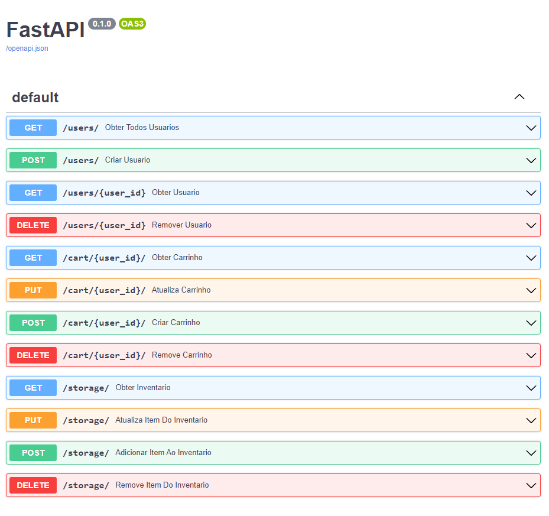

# Projeto SQL - MegaDados

## Introdução
Neste projeto vocês irão desenvolver um microsserviço de carrinho de compras.  
O projeto será realizado em duplas.  
A entrega será via Github.  
ATENÇÃO: AMBOS OS MEMBROS DA EQUIPE DEVEM CONTRIBUIR NA FORMA DE COMMITS.
PROJETOS COM APENAS UM CONTRIBUIDOR RESULTARÃO EM REPROVAÇÃO DE AMBOS OS 
MEMBROS DA EQUIPE. A participação não precisa ser exatamente igual, mas tem que ser de pelo 
menos 25% de um membro da equipe.  
Data de entrega da fase 1: 21/3/2022

## Requerimentos
• Usuário pode criar e deletar um carrinho de compras. Pode também alterar sua composição: 
adicionar e remover produtos. Você pode supor que já existe uma tabela de usuários, e que 
eles são identificados (chave primária) por um ID inteiro.
• Criar produto, consultar inventário de produtos, alterar produto, remover produto do 
inventário.

## CRUD
A sigla CRUD vem do inglês Create/Read/Update/Delete, que indica as funções principais de um 
sistema de armazenamento de informações:  
• Create: criar novos itens de dados;  
• Read: consultar o sistema para resgatar itens de dados armazenados;  
• Update: alterar itens de dados já existentes no sistema;  
• Delete: remover itens de dados do sistema.  
Esta sigla também é uma brincadeira em língua inglesa, já que a palavra crud significa sujeira – uma 
possível alusão ao estado deplorável de muitos sistemas de informação por aí afora!  
Nosso microsserviço é, portanto, um CRUD (mas não deverá ser crud, ok?)

## REST
A sigla REST significa REpresentational State Transfer. Trata-se de um padrão de projeto em
arquitetura de sistemas no qual um serviço de informações tem as seguintes características:  
• Arquitetura cliente-servidor: facilita a separação de responsabilidades entre a exibição da 
informação (responsabilidade do cliente) e o gerenciamento desta (no servidor)  
• Ausência de estado (statelessness): toda a informação necessária para satisfazer uma 
requisição do cliente deve estar contida na própria requisição – em um serviço RESTful não 
existe a noção de sessão.  
• Cacheability: Posto que os serviços que obedecem a estratégia REST não tem estado, 
podemos imaginar que duas consultas à mesma informação devem resultar na mesma 
resposta! (Diferente do caso em que haja estado armazenado no serviço, como um contador 
por exemplo). Claro que, entre duas consultas, a informação do banco de dados ao qual o 
serviço REST está conectado pode mudar. Um serviço REST deve, portanto, informar na sua 
resposta:  
  - se a informação provida é cacheable ou não
  - se for cacheable, por quanto tempo
• Sistema em camadas: um sistema REST não deverá saber se está diretamente conectado ao 
sistema cliente ou não. Com isso, é possível inserir camadas de sistema entre o cliente e o 
serviço RESTful, tais como caches, load balancers, proxies, etc.  
• Interface uniforme: Esta é uma das características principais de um sistema REST.  
  - Baseado em recursos: O sistema está organizado em torno da idéia de recursos e suas 
representações. Quando o sistema cliente quer manipular algum recurso, tal recurso 
estará identificado diretamente na URI. Por exemplo, em um serviço web RESTful para 
um restaurante, vamos supor que o cliente deseja saber quais os pratos do menu. A 
URI não deve ser algo do tipo {dominio}/sistema?action=consulta&section=pratos", 
mas sim “{dominio}/pratos”
  - Mas então como especificar a “ação” a ser realizada? Usando os verbos do protocolo 
HTTP!
    - Create: POST  
    - Read: GET  
    - Update: PUT (update/replace) ou PATCH (update/modify)  
    - Delete: DELETE  
• As respostas incluem toda a informação necessária para a manipulação do item de 
informação sendo enviado. Por exemplo: os metadados da resposta devem incluir 
informação sobre a cacheability do item, o tipo de dados (imagem, audio, texto, json, 
xml), etc. O estado da resposta também é relevante: uma resposta bem sucedida deve 
retornar o código 200, já uma condição de erro deve ser indicada com o código HTTP 
adequado (404, 420, etc).  
• Hypermedia As The Engine Of Application State (HATEOAS): a informação de uma 
requisição web e de uma resposta incluem, além do texto principal, uma série de 
metadados (código de resposta, headers) que são chamados de hipermídia. Alem 
disso, quando necessário, a resposta de um sistema web RESTful pode incluir URIs 
para que o sistema cliente recupere outras partes relevantes da informação, se 
autorizado a fazê-lo.  
• Code-on-demand: trata-se de uma característica opcional dos sistemas REST na qual o sistema 
pode retornar código executável (e.g. Javascript) ao cliente.
Para entender melhor como construir um sistema REST, leia o excelente material tutorial presente no 
site https://www.restapitutorial.com/ . Para ler em mais detalhes, o próprio site tem uma versão PDF 
do seu material, que é mais completa – veja a seção “Resources”  

## Atividade
Vamos construir uma API REST para o nosso microsserviço de lista de tarefas. Para facilitar 
enormemente nossa tarefa, vamos usar o framework FastAPI do Python para desenvolver nosso 
servidor.  
### Tarefa 1
Estude o material sobre REST do site tutorial mencionado acima. Do it. Do it. Doooo it.  
### Tarefa 2
Instale FastAPI (https://fastapi.tiangolo.com/) e faça o tutorial.  
• Faça todas as etapas do tutorial básico até “Dependencies” incluindo a parte sobre ORM!  
• Vocês vão ter que relembrar também como funciona o protocolo HTTP: verbos, estrutura das 
mensagens, URI, etc.  
• Não se iludam: VAI DEMORAR. Reserve no mínimo um dia inteiro para fazer esse tutorial. Para 
fazer bem-feito vai levar mais tempo ainda, pois a partir do tutorial você vai tomar contato 
com várias features de Python moderno: type hints, context managers, co-rotinas e Python 
assíncrono, especificação ASGI. Vai aprender também sobre frameworks interessantes para 
aplicações Web em Python: uvicorn (servidor ASGI), Starlette (framework Web), Pydantic 
(manipulação de dados e tipos em Python) entre outros.   
  - Dica das trincheiras: APROVEITE! Vocês vão ver o quanto vocês vão querer ter 
projetos na sua vida profissional onde vocês poderão aprender novas tecnologias!  
### Tarefa 3 (entregável)
Construa uma aplicação usando FastAPI que serve uma API REST para o projeto acima. Por enquanto 
não integre uma base de dados ao projeto, use apenas uma estrutura Python simples, como um 
dicionário ou uma lista – faz parte da atividade escolher a melhor ferramenta aqui!
Você deve criar um repositório git e mandar o link do repositório da sua equipe.
